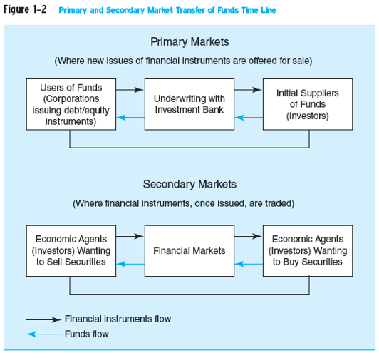
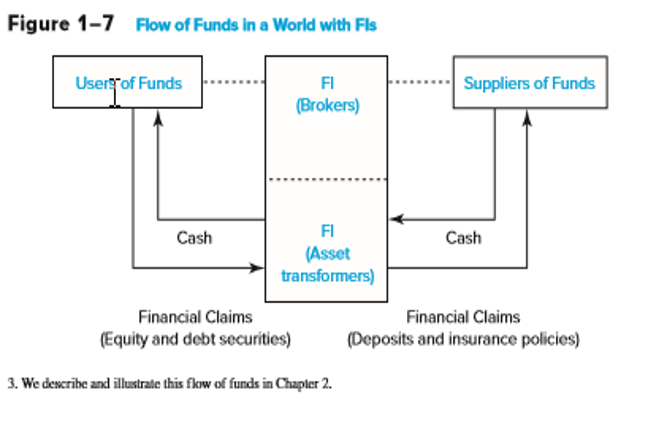

```{r setup, include=FALSE}
knitr::opts_chunk$set(echo = FALSE)
```

# Group Work

## What do we already know {.build .flexbox .vcenter}

  - What do you think of with the phrase
      -    **"Financial Insitutions"**?
      -    **"Financial Markets"**?

## How to structure {.build .flexbox .vcenter}

  - Visual Organization 
      - [Mindmap](https://www.xmind.net/m/6GpQ/)
      - [Concept Map](https://cmap.ihmc.us/docs/learn.php)

## Compare different groups visualizations


# Welcome

## Contact {.flexbox .vcenter}

  - Instructor: Larry Tentor
  - E-Mail:     TentorLB@VCU.edu
  - Career History
  
## Class Perspective

  - FIRE 622. Financial Management of Financial Institutions
  - Semester Focus: Financial Markets and Institutions- Through Their Data
  - We need to 
      - Understanding the institutions and their role within the system
      - The data that these institutions create and curate
      - Tools to process this data in a reproducible manner

<div class="notes">
This is my *note*.

- It can contain markdown
- like this list

</div>

## Systems

| Activity | Application | Cost |
|-----|---------|-------------|
|Interactive Text                | Connect from McGraw Hill | [1] |
|Learning Management System (LMS)| Blackboard              | Tuition |
|Analytics Platform              | RStudio in the Cloud    | $\emptyset$ |
|Training Platform               | DataCamp                | $\emptyset$ |
|Shared Communication            | Slack                   | $\emptyset$ |

1: Connect has complementary access for two weeks.
  
# Attribution

##  {.flexbox .vcenter}

Mcgraw Hill has provided power point slides that were substantially used to construct this R Markdown deck.

# Why Study

## Why Study Financial Markets and Institutions

Markets and institutions are primary channels to allocate capital in our society

Proper capital allocation leads to growth in:

  - Societal wealth 
  - Income
  - Economic opportunity

## Why "Through Their Data" 

- Provide the gateway items into financial analytics
    - Data Import
    - Data Structuring
    - Data Transformation
    - Data Visualization
    - Communication

- This class is not focusing on
    - Analytic Modeling
    
# Financial Markets & Institutions

## Financial Markets Categories

- Primary Markets versus Secondary Markets
- Money Markets versus Capital Markets

## Primary versus Secondary Markets

- Primary markets
    - Markets in which users of funds (e.g., corporations) raise funds by issuing new financial instruments (e.g., stocks and bonds)
- Secondary markets
    - Markets where existing financial instruments are traded among investors (e.g., exchange traded: NYSE and over-the-counter: NASDAQ)

## {.flexbox .vcenter}



© 2019 McGraw-Hill Education

## Primary versus Secondary Markets Concluded

- How were primary markets affected by the financial crisis?
- Do secondary markets add value to society or are they simply a legalized form of gambling?
- How does the existence of secondary markets affect primary markets?

## Money Markets verse Capital Markets

- Money markets
    - Markets that trade debt securities with maturities of one year or less (e.g., CDs and  U.S. Treasury bills)
little or no risk of capital loss, but low return
- Capital markets
    - Markets that trade debt (bonds) and equity (stock) instruments with maturities of more than one year substantial risk of capital loss, but higher promised return
    
## Financial Institutions

Financial Institutions

- Institutions through which suppliers channel money to users of funds

## {.flexbox .vcenter}

What if we did not have financial Institutions?

## Intermediated Flows of Funds {.flexbox .vcenter}



© 2019 McGraw-Hill Education

## Benefit Suppliers of Funds

- Reduce monitoring costs
- Increase liquidity and lower price risk
- Reduce transaction costs
- Provide maturity intermediation
- Provide denomination intermediation

## Benefit the Overall Economy

- Conduit through which Federal Reserve conducts monetary policy
- Provides efficient credit allocation
- Provide for intergenerational wealth transfers
- Provide payment services


## Depository versus Non-Depository FIs {.large}

- Depository institutions
    - commercial banks, savings associations, savings banks, credit unions
- Non-depository institutions
    - Contractual: Insurance companies and pension funds.
    - Non-contractual: Securities firms and investment banks, mutual funds.

## Risks Faced by Financial Institutions {.columns-2}

- Credit
- Foreign exchange
- Country or sovereign
- Interest rate
- Market

<p class="forceBreak"></p>

- Off-balance-sheet
- Liquidity
- Technology
- Operational
- Insolvency

Recent Legislation-

Volcker Rule: Insured institutions may not engage in proprietary trading

## Regulation of Financial Institutions

- FIs are heavily regulated to protect society at large from market failures
- Regulations impose a burden on FIs;  before the financial crisis, U.S. regulatory changes were deregulatory in nature
- Regulators attempt to maximize social welfare while minimizing the burden imposed by regulation

## Enterprise Risk Management

- Enterprise risk management
      - Recognizes the importance of managing the combined impact of the full spectrum of risks as an interrelated risk portfolio
- Popularity rose as a result of the failure of advanced risk measurement and management systems to detect exposures that led to the financial crisis
- Stresses importance of building a strong risk culture 

## Globalization of Financial Markets and Institutions

- The pool of savings from foreign investors is increasing and investors look to diversify globally now more than ever before
- Information on foreign markets and investments is becoming readily accessible and deregulation across the globe is allowing even greater access to foreign markets
- International mutual funds allow diversified foreign investment with low transactions costs
- Global capital flows are larger than ever

## FIs and the Crisis 2007-2009

- What do you know about the Global Financial Crisis (GFC)
     - Institutions involved
     - [Timeline](https://en.wikipedia.org/wiki/Financial_crisis_of_2007%E2%80%9308)

## Reflection


## Discussion on teaching software

- Times I will ask for your undivided attention
      - Hands up
      - Close computers
- Platforms I had taught using
- [Pair Programming](https://docs.google.com/presentation/d/1E-afLHWmYcTjO0z_hBpAw3AL4Gp4qVQNLOsxP_hq3fI/edit#slide=id.p)


## R-Studio in the Cloud

  - Sign up for R-Studio in the Cloud
  - Activate class shared space, link on blackboard.


## Tasks
  
  - Sign up for DataCamp
      - Complete "Introduction to R for Finance"
  - Sign up for Slack
  - Reading Assignements
  
  

 


