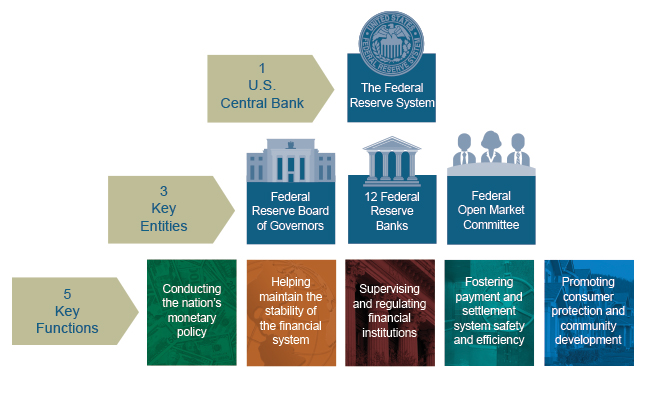
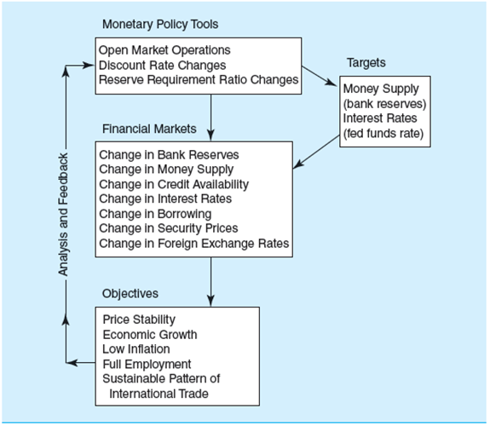

---
references:
- id: FRB
  title: Purpose and Function
  author: 
    - family: Federal Reserve Bank
  URL: 'https://www.federalreserve.gov/aboutthefed/files/pf_complete.pdf'
  type: book
  issued:
    year: 2016
    month: 10
- id: FRBComic
  title: The Story of The Federal Reserve System
  author: 
    - family: Federal Reserve Bank
  URL: 'https://www.newyorkfed.org/medialibrary/media/outreach-and-education/comic-books/NewYorkFed-StoryoftheFederalReserveSystem-WebColor.pdf'
  type: book
  issued:
    year: 2018
- id: FedFunds
  title: Real Gross Domestic Product [FEDFUNDS]
  author: 
    - family: U.S. Bureau of Economic Analysis
  URL: 'https://fred.stlouisfed.org/series/FedFunds'
  type: book
  issued:
    year: 2019
---


```{r setup, include=FALSE}
library(DiagrammeR)
knitr::opts_chunk$set(echo = FALSE)
```

# Attribution

##  {.flexbox .vcenter}

Mcgraw Hill has provided power point slides that were substantially used to construct this R Markdown deck.

# Quiz Items

## {.smaller}

What factors are encouraging financial institutions to offer overlapping financial services such as banking, investment banking, brokerage, etc.?

1. Regulatory changes allowing institutions to offer more services
2. Technological improvements reducing the cost of providing financial services
3. Increasing competition from full-service global financial institutions
4. Reduction in the need to manage risk at financial institutions

- A. I only
- B. II and III only
- C. I, II, and III only
- D. I, II, and IV only
- E. I, II, III, and IV

##

_________ and __________ allow a financial intermediary to offer safe liquid liabilities such as deposits while investing the depositors' money in riskier illiquid assets.

- A. Diversification; high equity returns
- B. Price risk; collateral
- C. Free riders; regulations
- D. Monitoring; diversification
- E. Primary markets; foreign exchange markets

# Institutional Knowledge of the <br /> Federal Reserve Bank

## History

* Founded by Congress under the Federal Reserve Act in 1913.
* Subject to oversight by Congress under its authority to create money.
* An independent central bank
    * its decisions do not have to be ratified by the President or Congress.
    * Congressional oversight.

## Primary Source

* [Federal Reserve System, Purposes and Functions](https://www.federalreserve.gov/aboutthefed/pf.htm)
* Overview of the Federal Reserve System


## Entities of the Federal Reserve System
{width=650px}

[@FRB]

## Structure (continued)

* Divided into 12 Federal Reserve districts, each with a main Federal Reserve Bank.
* Federal Reserve Banks operate under the general supervision of the Board of Governors of the Federal Reserve.
* The Office of the Comptroller of the Currency (OCC) charters national banks, which are members of the Federal Reserve System (FRS).
* FRS member banks “own” the 12 Federal Reserve Banks.

## Board of Governors

* Seven member board headquartered in Washington, DC.
* President appoints and Senate confirms members to nonrenewable 14-year terms.
    - [Current News](https://www.ft.com/content/a9084790-38b6-11ea-a6d3-9a26f8c3cba4)
* President appoints and Senate confirms Chairman and vice-chairman to renewable 4-year terms.
* Formulates and conducts monetary policy and supervises and regulates banks.

## Federal Reserve Banks  {.flexbox .vcenter}

* Assist in the conduct of monetary policy.
    - Set and change the discount rate (must be approved by the Board of Governors).
    - Make discount window loans to depository institutions.
* Supervise and regulate F R S member banks.
    - Conduct examinations and inspections of member banks.
    - Issue warnings when banking activity is unsafe or unsound.
    - Approve bank mergers and acquisitions.
* Provide government services.
    - Act as the commercial banks of the U.S. Treasury.

## Federal Reserve Banks (continued)  {.flexbox .vcenter}

* Issue new currency
    - Collect and replace currency in circulation as necessary.
* Clear checks
    - Act as a central clearing system for U.S. banks.
* Provide wire transfer services
    - Fedwire.
    - Automated Clearinghouse (A C H)
* Perform banking sector and economic research
    - Used in the formulation of monetary policy.


## Key Functions of the Federal Reserve System
{width=750px}
[@FRB]

## The Five Key Functions {.flexbox .vcenter}

  1. Conducting Monetary Policy
  2. Promoting Financial System Stability
  3. Supervising and Regulating Financial Institutions and Activities
  4. Fostering Payment and Settlement System Safety and Efficiency
  5. Promoting Consumer Protection and Community Development
  
  
## 1. Conducting Monetary Policy {.flexbox .vcenter}
  
* Monetary policy affects the macroeconomy by influencing the supply and demand for excess bank reserves.
* Influences the money supply and the level of short-term and long-term interest rates.
* Affects foreign exchange rates, the amount of money and credit in the economy, and the levels of employment, output, and prices.

## 1. Conducting Monetary Policy (continued) {.flexbox .vcenter}

* Federal Open Market Committee (FOMC)
    - FOMC consists of twelve (12) members.
    - All (7) members of the Board of Governors.
    - The president of the Federal Reserve Bank of New York.
    - The presidents of four other Federal Reserve Banks (on a rotating basis).
    - The major monetary policy-making body of the FRS
* [Meetings and press releases](https://www.federalreserve.gov/monetarypolicy/fomccalendars.htm)

## 1. Conducting Monetary Policy (continued) {.flexbox .vcenter}

* Policies seek to promote full employment, economic growth, price stability, and a sustainable pattern of international trade.
* Are there tradeoffs between these goals?
* Why is international monetary cooperation necessary?

## 1. Conducting Monetary Policy (continued) {.flexbox .vcenter}

* The FOMC sets ranges for growth of monetary aggregates and the fed funds rate, and also directs operations in FX markets.
* Open market operations are the main policy tool used to achieve monetary targets:
    - involve the purchase and sale of U.S. government and federal agency securities.
    - are implemented by the Federal Reserve Board Trading Desk of the New York Federal Reserve Bank.

## Open market operations {.flexbox .vcenter}

* Policy directive of the FOMC is forwarded to the Federal Reserve Board Trading Desk at the Federal Reserve Bank of New York.
* Trading Desk manager buys or sells U.S. Treasury securities in the over-the-counter (OTC) market, which keeps the fed funds rate near its desired target.
* FRBNY acts through the Trading Desk to implement policy directives each business day.
    - Operations may be permanent or temporary.
    - May use repurchase agreements for temporary increases or decreases in excess reserves.


## Monetary Policy

Figure 4-5 The Process of Monetary Policy Implementation
{width=550px}
(c) McGraw Hill


## Discount Rate

* The discount rate is the rate Federal Reserve Banks charge on loans to financial institutions in their district.
* The Federal Reserve rarely uses the discount rate as a policy tool.
    - Discount rate changes are strong signals of the Federal Reserves intentions.
    - There is no guarantee that banks will borrow, nor that they will lend.
  
## 3. Supervising and Regulating Financial Institutions and Activities {.flexbox .vcenter}

* The Wall Street Reform and Consumer Protection Act of July 2010 requires the Fed to supervise complex financial institutions that could generate systemic risk to the economy.
* The Fed (and others) has now been given broader powers to seize or break up institutions whose actions could harm the economy.


## 5. Promoting Consumer Protection and Community Development  {.flexbox .vcenter}

* Implementing federal laws designed to protect consumers in credit and other financial transactions.  
* Implementing regulations to ensure compliance, investigating complaints, and ensuring availability of services to low and moderate income groups and certain geographic regions.


## Balance Sheet
Major liabilities.
Reserve deposits.
Currency in circulation.
Note that currency in circulation + reserves = monetary base.
Major assets.
Treasury securities.
U.S. government agency securities.


## Concept Map


<div class="notes">
This is my *note*.

- It can contain markdown
- like this list

</div>

A concept map outline for the Federal Reserve System.

```{r}
conceptMapFed <- '
graph LR
  A((Federal Reserve System))-- conducts -->B[Nations Monetary Policy]
  A-- provide -->C[payments system]
  A-- supervise -->D[financial system]
  E[United States]--has--> A
  E-- has -->B
  A-- has -->F[12 Districts]
  F-- lead by -->G[Regional Reserve Banks]
  G-->|headquartered| H[Atlanta-06 <br /> Boston-01 <br /> Chicago-07 <br /> Cleveland-04 <br /> Dallas-11 <br /> Kansas City-10 <br /> Minneapolis-09 <br /> New York-02 <br /> Philadelphia-03 <br /> Richmond-05 <br /> St. Louis-08 <br /> San Francisco-12]
  G-- operates --> V[independently with <br /> supervision] 
  subgraph 1. Conduct the Nations Monetary Policy
    B-- primary tool -->I[FOMC <br /> Federal Open Markets Committee]
    I-- influences -->K[MoneySupply]
    I-- voting members --> U[Seven Govenors and <br />Five Rotating Regional Presidents]
  end
  subgraph 2. Maintain the stability of the Financial System
    FinancialSystem["Financial System"]
  end
  A -- maintain --> FinancialSystem
  subgraph 3. Supervises and Regulate Financial Institutions
    subgraph Depository Institutions 
      L[Banks]
      M[Savings and Loans]
      N[Credit Unions]
    end
    D-- including --> L
    D-- including --> M
    D-- including --> N
  end
  subgraph 4. Provide and Maintain an Effective and Efficient Payments System
    C-- handles --> Q[Processing and <br /> Clearing Checks]
    C-- handles --> R[issuing, transferring and redeeming <br /> U.S. government securities]
    C-- transfers --> S[Funds]
  end
  subgraph 5. Promote Consumer Protection and Community Development
    Consumer["Comsumer Protection"]
    Community["Community Development"]
  end
  A -- promote --> Consumer
  A -- promote --> Community
  subgraph Government
    E-- legislates by -->J[Congress]
    E-- lead by -->P[Executive <br /> President]
  end  
  J-- created,1913 -->A
  O[Board of Governors]-- governs-->A
  J-- approves --> O
  P-- appoints --> O
  O-- contains --> T[Seven Members <br /> 14 year terms]
  O-- consults --> Advisory["Advisory <br /> Boards"]
  subgraph Avdisory Boards
    Advisory --> FAC["Federal Advisory  <br /> Council (FAC)"]
    Advisory --> CDIAC["Community Depository Institutions <br /> Advisory Council (CDIAC)"]
    Advisory --> Model["Model Validation Council"]
    Advisory --> CAC["Community Advisory <br /> Council (CAC)"]
  end
  L -.-> FAC
  M -.-> CDIAC 
  N -.-> CDIAC 
  ;
'
mermaid(conceptMapFed)
#  Advisory --> FAC['Federal Advisory <br /> Council (FAC)']

```

# Data of the <br /> Federal Reserve Bank

## Federal Reserve Economic Data (FRED)
 
* St. Louis Regional bank maintains FRED
* FRED is a data aggregation platform available to the public
* 89 sources, 627,000 series domestic and international
* Federal Reserve Bank Data Examples
  * Base Website: https://fred.stlouisfed.org/
  * [Federal Funds, monthly, not seasonally adjusted](https://fred.stlouisfed.org/series/FEDFUNDS)
  * [M1 Money Supply, seasonally adjusted weekly](https://fred.stlouisfed.org/series/M1)
  
## Exercise: Downloading FRED Data

* Goto FRED website (https://fred.stlouisfed.org/)
* Search for M1
* Select "M1 Money Stock"
* Select download, select csv format and place in new directory on your computer.
* On RStudio.Cloud > File > Upload > Select local file to move to RStudio.cloud.
* Review file in a text editor.

<div class="notes">
As of Nov 2019, the number of lines was 786, including a header line, 784 lines of data, and a final blank line.
</div>


# Institutional Knowledge <br /> additional US entities <br /> part of the data fabric

## Additional Data Providors {.flexbox .vcenter}

* [Bureau of Economic Analysis](https://www.bea.gov/) 
    - [Consumer Price Index (CPI-U)](https://fred.stlouisfed.org/series/CPIAUCSL)
* [U.S. Bureau of Labor Statistics](https://www.bls.gov/)
    - [Unemployment Rate](https://fred.stlouisfed.org/series/UNRATE)
* [National Bureau of Economic Research](https://www.nber.org)
    - [Business Cycle Dating Process](https://www.nber.org/cycles/recessions_faq.html)
    - [Business Cycle Dating Data](https://fred.stlouisfed.org/series/USREC)

## References


