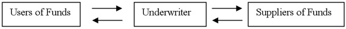
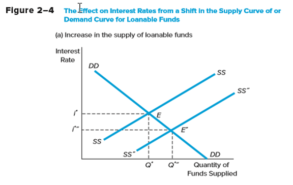
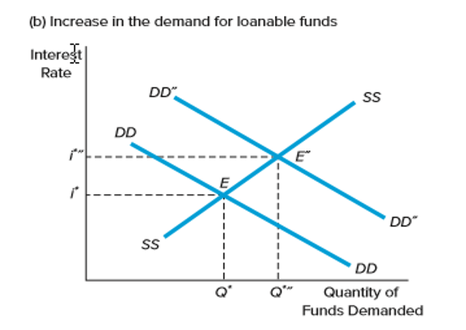
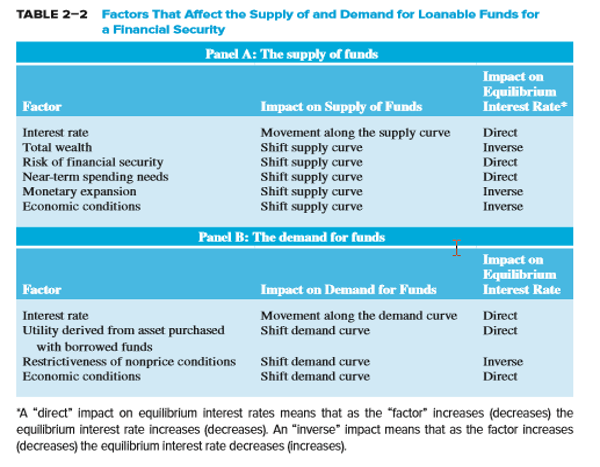

```{r setup, include=FALSE}
#library(DiagrammeR)
#install.packacge('FinancialMath')
#install.package('')
library(FinancialMath)
library(YieldCurve)
knitr::opts_chunk$set(echo = FALSE)
```

# Attribution

##  {.flexbox .vcenter}

McGraw Hill has provided power point slides that were substantially used to construct this R Markdown deck.

# Quiz Items

##

Duration is

1. the elasticity of a security's value to small coupon changes.
2. the weighted average time to maturity of the bond's cash flows.
3. the time until the investor recovers the price of the bond in today's dollars.
4. greater than maturity for deep discount bonds and less than maturity for premium bonds.
5. the second derivative of the bond price formula with respect to the YTM.

> - Answer: 2

##

Financial intermediation provides direct transfer of funds to the users.

- True
- False

> - Answer: False.  Intermediation requires an intermediary.

##

The diagram below is a diagram of the
 
{width=550px}

1. secondary markets.
2. primary markets.
3. money markets.
4. derivatives markets.
5. commodities markets.

> - Answer: 2. primary markets.

## {.smaller}

A 10-year annual payment corporate bond has a market price of $1,050. It pays annual interest of $100 and its required rate of return is 9 percent. By how much is the bond mispriced?

1. $0.00
2. Overpriced by $14.18
3. Underpriced by $14.18
4. Overpriced by $9.32
5. Underpriced by $9.32

## {.smaller}

A 10-year annual payment corporate bond has a market price of $1,050. It pays annual interest of $100 and its required rate of return is 9 percent. By how much is the bond mispriced?

1. $0.00
2. Overpriced by $14.18
3. Underpriced by $14.18
4. Overpriced by $9.32
5. Underpriced by $9.32

```{r PVBond, echo=TRUE}
PV <- 100/(1.09)^1 + 100/(1.09)^2 + 100/(1.09)^3 + 100/(1.09)^4 + 100/(1.09)^5 +
      100/(1.09)^6 + 100/(1.09)^7 + 100/(1.09)^8 + 100/(1.09)^9 + 100/(1.09)^10 +
      1000/(1.09)^10

PV-1050

```

> - Answer: 3

##

If the Fed wishes to stimulate the economy, it could

~~~
    I. buy U.S. government securities.
   II. raise the discount rate.
  III. lower reserve requirements.
~~~

1. I and III only
2. II and III only
3. I and II only
4. II only
5. I, II, and III

> - Answer: 1

## Nominal & Real Rates

## Definitions

Write out -- Explain the nominal interest rate

Write out -- Explain the real interest rate

## Nominal Interest Rates

- Nominal interest rates: the interest rates actually observed in financial markets
    - Used to determine fair present value and prices of securities
    - Two components:
        - Opportunity cost
        - Adjustments for individual security characteristics

## Real Riskless Interest Rates

- Additional purchasing power required to forego current consumption
    - What causes differences in nominal and real interest rates?
    - If you wish to earn a 3% real return and prices are expected to increase by 2%, what rate must you charge?
    - Irving Fisher first postulated that interest rates contain a premium for expected inflation.

# Class Problems

## Problem A: Accured Interest

If you deposit $500 in a bank account that earns 6 percent per year, how much total interest will you have earned after the third year? 

## Problem A: Accured Interest- One Solution

If you deposit $500 in a bank account that earns 6 percent per year, how much total interest will you have earned after the third year? 

```{r A, echo=TRUE}
AccumulatedInterest <- 500 * 
                       ((1.06)*(1.06)*(1.06)*(1.06)*(1.06)*(1.06) - 1)

AccumulatedInterest
```

## Problem B: Compound Interest

You can save $1,000 per year for the next four years in an account earning 10 percent per year. How much will you have at the end of the fourth year if you make the first deposit today?

## Problem B: Compound Interest - One Solution

You can save $1,000 per year for the next four years in an account earning 10 percent per year. How much will you have at the end of the fourth year if you make the first deposit today?


```{r B, echo=TRUE}
#          v year one deposit
#          v              v year two deposit
#          v              v               v year three deposit
#          v              v               v              v year four deposit
FV <- (((((1000 * 1.10) + 1000) * 1.10) + 1000 * 1.10) + 1000 * 1.10)
#                 ^               ^              ^              ^ growth from fourth year
#                 ^               ^              ^ growth from third year
#                 ^               ^ growth from second year
#                 ^ growth from first year
FV
```

## Problem C: Present Value 

Calculate the present value of $5,000 received five years from today if your investments pay

- 6 percent compounded annually
- 8 percent compounded annually
- 10 percent compounded annually

What do your answers to these questions tell you about the relation between present values and interest rates and between present values and the number of compounding periods per year?

## Problem C: Present Value - Solution [1]


```{r C, echo=TRUE}
r  <- 6
g  <- 1/(1+ r/100)
PV <- (((((5000 * g) * g) * g) * g) * g)
print(paste0(' Interest Rate ', as.character(r), ', PV ', as.character(PV))) 

r  <- 8
g  <- 1/(1+ r/100)
PV <- (((((5000 * g) * g) * g) * g) * g)
print(paste0(' Interest Rate ', as.character(r), ', PV ', as.character(PV))) 
```

## Problem C: Present Value - Solution [2]

```{r C2, echo=TRUE}
r  <- 10
g  <- 1/(1+ r/100)
PV <- (((((5000 * g) * g) * g) * g) * g)
print(paste0(' Interest Rate ', as.character(r), ', PV ', as.character(PV))) 
```
What do your answers to these questions tell you about the relation between present values and interest rates and between present values and the number of compounding periods per year?

> - As interest rates rise, present value falls.

## Problem D: Forward Rates

The current one-year Treasury-bill rate is 5.2 percent and the forward one-year rate 12 months from now is 5.8 percent. For no arbitrage to hold, what should be the current two year spot rate be.

## Problem D: Forward Rates- One Solution

The current one-year Treasury-bill rate is 5.2 percent and the forward one-year rate 12 months from now is 5.8 percent. For no arbitrage to hold, what should be the current two year spot rate be.

```{r D, echo=TRUE}
r_1_1  <- 5.2/100
r_2_1  <- 5.8/100

r_1_2  <- (((1+r_1_1)*(1+r_2_1))^(1/2)-1)*100

r_1_2

```


# Interest Rate Types

## Yield to Maturity

A two-year US Treasury bond today trades at $98.1, for a $100 face value payable in two years.  The coupon rate is 5% payable semi-annual.  What is the yield to maturity?

## Yield to Maturity: One Solution

A two-year US Treasury bond today trades at $98.1, for a $100 face value payable in two years.  The coupon rate is 5% payable semi-annual.  What is the yield to maturity?

```{r YTM, echo=TRUE}
library(FinancialMath)
face       <- 100
price      <- 98.1
rateCoupon <- 5/100/2
cashCoupon <- face*rateCoupon
cf         <- c(cashCoupon, cashCoupon, cashCoupon, cashCoupon + face)
ts         <- c(1,2,3,4)

ytm        <- (IRR(cf0 = -price, cf = cf, times = ts)) * 100 * 2
ytm
```


## Par Rate

- This is created by the yield to maturity of a collection of bonds.
- The risk-free version used Treasury securities.

Par Rate Data in R
```{r ParRate, echo=TRUE}
library(YieldCurve)
data(FedYieldCurve)
#class(FedYieldCurve)
head(FedYieldCurve)
summary(FedYieldCurve)
colnames(FedYieldCurve)
```

##

```{r ParRatePlot, echo=TRUE}
maturityBond <- c(1/4,1/2,1,2,3,5,7,10) 
plot(maturityBond,FedYieldCurve[1,])
FedYieldCurve[1,]
```
## Discount Rates

So now that you see the term structure expressed in a par curve. If we have a single cash flow at two years what is the correct discount rate to use to discount back?

## Converting Par to Zero/Spot Rate - 1

| Term    | Yield  | Number of Payments | YTM    | Spot Rate |
|---------|--------|--------------------|--------|-----------|
| 3 mo    | 12.92% |        ?           |   ?    |    ?      | 
| 6 month | 13.90% |        ?           |   ?    |    ?      |
| 1 year  | 14.32% |        ?           |   ?    |    ?      |  
| 2 year  | 14.57% |        ?           |   ?    |    ?      |

## Converting Par to Zero/Spot Rate - 2

| Term    | Yield  | Number of Payments | YTM    | Spot Rate |
|---------|--------|--------------------|--------|-----------|
| 3 mo    | 12.92% |       1            | 12.92% | 12.92%    | 
| 6 month | 13.90% |       1            | 13.90% | 13.90%    |
| 1 year  | 14.32% |       1            | 14.32% | 14.32%    |  
| 2 year  | 14.57% |       4            | 14.57% |    ?      |

How do we calculate spot rate for two years out?

## Converting Par to Zero/Spot Rate - 2

*2 year bond, Cash Flow*

| Term       | Cash Flow | Spot Rate | 
|------------|-----------|-----------|
| 6 month    |  $14.57   | 13.90%    | 
| 1 year     |  $14.57   | 14.32%    |
| 1 1/2 year |  $14.57   | ?         | 
| 2 year     | $114.57   | ?         |

```{r, echo=TRUE}
maturityBond <- c(0.5,1,1.5,2) 
payments     <- c(14.57/2,14.57/2,14.57/2,100+14.57/2)

zero06m       <- 13.90/100
zero01        <- 14.32/100
par02         <- 14.57/100
pricePar02    <- 100;
f             <- function (x) pricePar02 - (
                                ((par02/2  )*100/(1+zero06m      )^(1/2))+
                                ((par02/2  )*100/(1+zero01       )      )+
                                ((par02/2  )*100/(1+(x+zero01)/2 )^(3/2))+ # Assumed average yield for 1 1/2
                                ((par02/2+1)*100/(1+x            )^(2)  )
                                )
root02        <- uniroot(f,c(0,2*par02),tol=.Machine$double.eps^0.5)
zero02        <- root02$root
zero015       <- (zero02+zero01)/2

zeroCurve <- c(zero06m,zero01,zero015,zero02)*100
zeroCurve
```
## Implied Forward Rates

- A forward rate (f) is an expected rate on a short-term security that is to be originated at some point in the future
- The one-year forward rate for any year, N years into the future is:

$_Nf_1 = [(1+_1R_N)^{N}/(1+_1R_{N-1})^{N-1}]-1$


# Appendix

## Loanable Funds Theory {.flexbox .vcenter}

- Loanable funds theory explains interest rates and interest rate movements
- Views level of interest rates as resulting from factors that affect the supply of and demand for loanable funds
- Categorizes financial market participants – e.g., consumers, businesses, governments, and foreign participants – as net suppliers or demanders of funds

## Determinants of Household Savings {.flexbox .vcenter}

1. Interest rates and tax policy
2. Income and wealth: the greater the wealth or income, the greater the amount saved 
3. Attitudes about saving versus borrowing 
4. Credit availability: the greater the amount of easily obtainable consumer credit the lower the need to save 
5. Job security and belief in soundness of entitlements

## Determinants of Foreign Funds Invested in the U.S.  {.flexbox .vcenter}

1. Relative interest rates and returns on global investments
2. Expected exchange rate changes
3. Safe haven status of U.S. investments
4. Foreign central bank investments in the U.S.

## Federal Government Demand for Funds Concluded

- Governments borrow heavily in the markets for loanable funds
    - $23.19 trillion in 2016
- United States
    - National debt was $19.21 trillion in 2016
        - National debt (and interest payments on the national debt) have to be financed in large part by additional borrowing

## Business Demand for Funds

- Level of interest rates: 
    - When the cost of loanable funds is high (i.e., interest rates are high), businesses finance internally
- Expected future profitability vs. risk: 
    - The greater the number of profitable projects available to businesses, the greater the demand for loanable funds
- Expected economic growth

## Effect on Interest Rates from a Shift in the Supply Curve for Loanable Funds

{width=550px}

© 2019 McGraw-Hill Education.

## Effect on Interest Rates from a Shift in the Demand Curve for Loanable Funds

{width=550px}

© 2019 McGraw-Hill Education.

## Loanable Funds Supply of and Demand Factors {.smaller}



© 2019 McGraw-Hill Education.


## Term Structure of Interest Rates:the Yield Curve

(a)  Upward sloping
(b)  Inverted or downward sloping
(c)  Flat

## Unbiased Expectations Theory

Current long-term interest rates (1RN) are geometric averages of current and expected future, E(Nr1), short-term interest rates

$_1R_N = [(1+_1R_1)(1+E(_2r_1))...(1+E(_Nr_n))]^{1/N}-1$

$_1R_N$  = actual N-period rate today
$N$      = term to maturity, N = 1, 2, …, 4, …
$_1R_1$  = actual current one-year rate today
E(_ir_1) = expected one-year rates for years, i = 1 to N

## Liquidity Premium Theory


$_1R_N = [(1+_1R_1)(1+E(_2r_1) + L_2)...(1+E(_Nr_n)+L_N)]^{1/N}-1$

$L_i$  = liquidity premium for period t
$L_2 < L_3 < … < L_N$

## Market Segmentation Theory

- Individual investors and FIs have specific maturity preferences
- Interest rates are determined by distinct supply and demand conditions within many maturity segments
- Investors and borrowers deviate from their preferred maturity segment only when adequately compensated to do so


