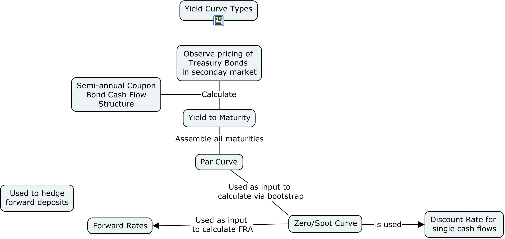
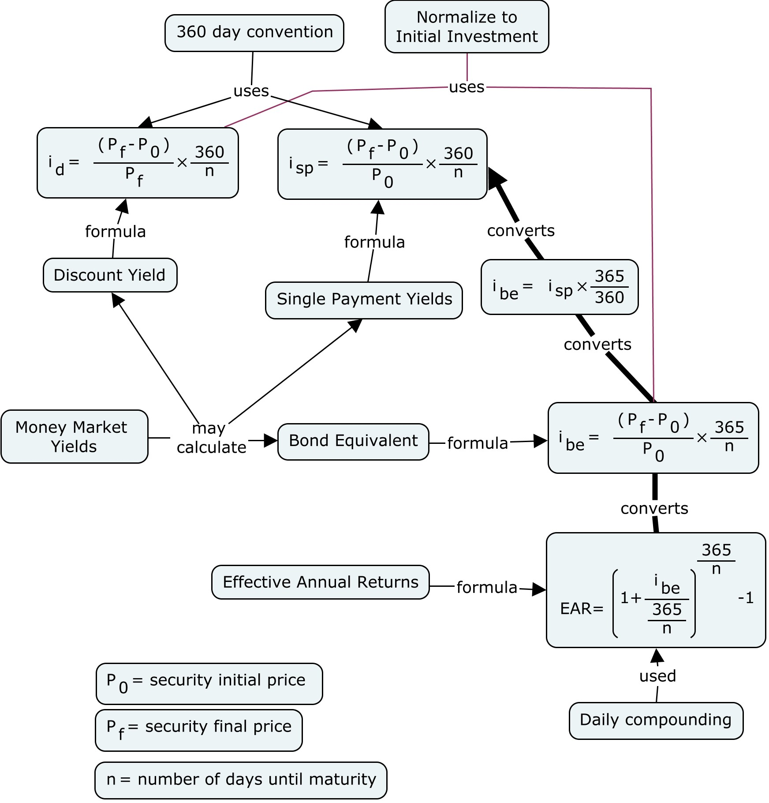

```{r setup, include=FALSE}
#library(DiagrammeR)
#install.packacge('FinancialMath')
#install.package('')
library(FinancialMath)
library(YieldCurve)
knitr::opts_chunk$set(echo = FALSE)
```

# Attribution

##  {.flexbox .vcenter}

McGraw Hill has provided power point slides that were substantially used to construct this R Markdown deck.

# Quiz Items

##

Ignoring default risk, if a bond's expected return is greater than its required return, then the bond's market price must be greater than the present value of the bond's cash flows.

* True
* False

> - Answer: False

##
A semiannual payment bond with a $1,000 par has a 7 percent quoted coupon rate, a 7 percent promised YTM, and 10 years to maturity. What is the bond's duration?

~~~
A. 10.00 years
B. 8.39 years
C. 6.45 years
D. 5.20 years
E. 7.35 years
~~~

> - Answer: E Σ[(t × CFt/(1.035)^t)]/($1,000)

## 

Who can help intepret?

```{r, echo=TRUE}

period           <-  1:20
cf_interest      <- (35)/(1.035^period)
cf_principle     <- 0*period
cf_principle[20] <- 1000/(1.035^20)

durationperperiod <- period/2*(cf_interest+cf_principle)/1000

duration          <- sum(durationperperiod)
duration

```


# Term Structure of Interest Rates

## Term Structure of Interest Rates

The diagram below is a diagram of the relations of interest rates

{width=650px}

# Money Markets

## Money Market Interest Rate Yields {.flexbox .vcenter}

{height=500px}

## Money Market Interest Rate Yields {.flexbox .vcenter}

{height=500px}

